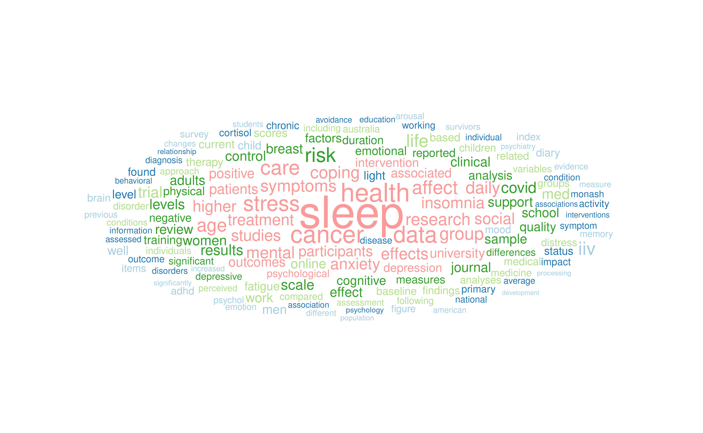

```{r load_packages, message=FALSE, warning=FALSE, include=FALSE} 

## load packages and setup
source("package_setup.R", echo=FALSE)

txttrans <- function(text){
  text = tm_map(text, content_transformer(tolower))
  text = tm_map(text, removePunctuation)
  text = tm_map(text, content_transformer(removeNumbers))
  text = tm_map(text, removeWords,
    c(stopwords("english"), "may", "also", "low", "high", "using", "stanton",
      "seeman", "bower", "study", "model", "models", "rights", "license",
      "wiley", "oxford", "see", "however", "page", "can", "print", "view",
      "california", "subscriber", "title", "los", "angeles",
      "wwwoxfordhandbookscom", "pdf", "mean", "total", "although", "across",
      "two", "less", "article", "among", "whether", "within", "included", "use",
      "first", "doi"))
  tm_map(text, content_transformer(stripWhitespace))
}

jw <- Corpus(DirSource("~/OneDrive/Manuscripts/Publications/", pattern="pdf"),
             readerControl = list(reader=readPDF))
jw2 <- txttrans(jw)
## summary(jw2)

png(filename = "~/OneDrive/Manuscripts/Publications/wordcloud.png", width = 10, height = 10, units = "in", res = 400)
wordcloud(jw2, scale=c(5,0.5), max.words=100, random.order=FALSE,
          rot.per=0.35, use.r.layout=FALSE, colors=brewer.pal(8, "Dark2"))
dev.off()


png(filename = "~/OneDrive/Manuscripts/Publications/wordcloud_banner.png", width = 12, height = 4, units = "in", res = 400)
wordcloud(jw2, scale=c(6,0.2), max.words=150, random.order=FALSE,
          rot.per=0, use.r.layout=FALSE, fixed.asp = FALSE, colors=brewer.pal(8, "Dark2"))
dev.off()

png(filename = "~/OneDrive/Manuscripts/Publications/wordcloud_small.png", width = 5, height = 5, units = "in", res = 400)
wordcloud(jw2, scale=c(5,0.1), max.words=50, random.order=FALSE,
          rot.per=0.35, use.r.layout=FALSE, colors=brewer.pal(8, "Dark2"))
dev.off()

png(filename = "wordcloud_banner.png", width = 12, height = 4, units = "in", res = 400)
wordcloud(jw2, scale=c(6,0.2), max.words=150, random.order=FALSE,
          rot.per=0, use.r.layout=FALSE, fixed.asp = FALSE, colors=brewer.pal(8, "Dark2"))
dev.off()


```

Our research uses digitomics[^1] to understand the connections between
sleep, psychosocial factors, and health. Reflecting our belief that
both mental and physical health are important and interconnected, many
of our research projects integrate mental and physical health.

*Topics* our team has expertise in include stress, resilience
and emotion regulation, depression and anxiety, sleep and insomnia,
and cancer.

*Methods* our team has expertise in include ecological momentary
assessment, actigraphy, statistics and machine learning, and clinical
trials.

We leverage the latest science from our team and others to evaluate
and optimise interventions to improve sleep, reduce insomnia symptoms,
and promote mental health, particularly in people who are or have been
treated for cancer or are experiencing other sources of high stress.

Our team is lead by Dr. Joshua Wiley and is situated within the 
Turner Institute for Brain and Mental Health 
[(Turner)](https://www.monash.edu/turner-institute) 
within the Sleep and Circadian Rhythms Program. To see an example of
the sort of work we do and how we work to feed findings back to our
participants and the community, take a look at our
[projects](projects.html) and look at some of the reports we have sent 
our participants there.

<br></br>

The word cloud below provides a data-driven summary of the type
of work our lab conducts. The word cloud is based off papers published
from our lab. Word size shows how commonly specific words appear in
our work.



<br></br>

[^1]: Digitally collected data either actively (e.g., completing mood
    surveys via an app; brief audio recordings of stress experienced
    in the past few hours) or passively (e.g., using sensor data from
    smartphones, wearables, mining social media). Often, large amounts
    of data are generated, either due to many features, many
    timepoints, or both.

## Joshua F. Wiley

Dr. Joshua Wiley is a behavioural medicine researcher currently
appointed as a lecturer (Asst. Professor) at Monash University in the
School of Psychological Sciences and Turner (2016-present). He studied
health psychology and behavioural medicine, completing his PhD at the
University of California at Los Angeles in 2015. Subsequently, he
trained in pragmatic randomised controlled trials (RCTs) through post
doctoral with a primary care and prevention group.

Dr. Wiley's research includes basic science and applied intervention
work. In basic science, his work focuses on understanding the daily
and longitudinal dynamics of sleep, psychosocial factors and health,
emphasising potentially malleable mechanisms driving poor sleep and
health. His intervention work targets the basic science mechanisms
identified to attempt to improve population health. His intervention
research focuses on accessible and feasible sleep/behavioural and
emotion regulation interventions with potential for broad
dissemination. Aligned with recent calls for personalised medicine,
his group combines digitomics and cutting edge data analytics to drive
personalised predictions and recommendations to help optimise the
content, targetting, and delivery of their interventions. New tools 
and data analytic pipelines developed for his projects are routinely
shared freely and have been picked up in many other studies and
projects.

Reflecting the global reach of his research, Dr. Wiley has helped
obtain competitive federal grant funding from the Australian Research
Council (ARC), United States National Institutes of Health (US NIH),
and United States Department of Defense (US DoD), totalling >$4
million in funding. He has >50 peer-reviewed publications resulting in
>1,000 citations (GS).

### `r fa("address-card", fill = "black")` Connect

  - <span class="fa fa-github"></span> 
    [github](https://github.com/jwiley) -  <span class="fa fa-google"></span> [Google Scholar](https://scholar.google.com/citations?user=bRG3LSQAAAAJ&hl=en)
  - <span class="fa fa-linkedin"></span> 
    [linkedin](https://www.linkedin.com/in/joshua-wiley-6a0b2278) - <span class="fa fa-twitter"></span> [twitter](http://twitter.com/WileyResearch)
  - <span class="fa fa-envelope"></span> joshua.wiley _at_ monash
    _dot_ edu
