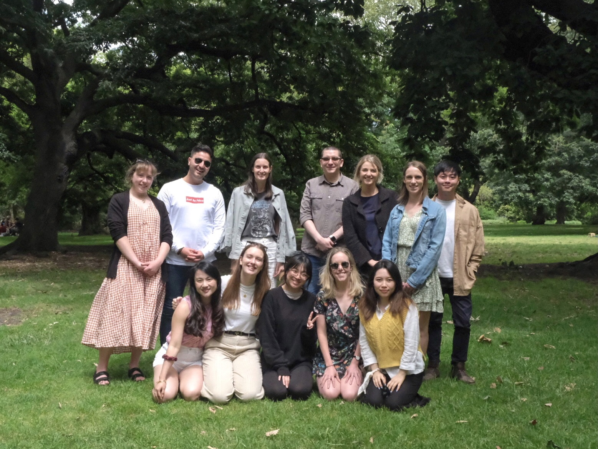
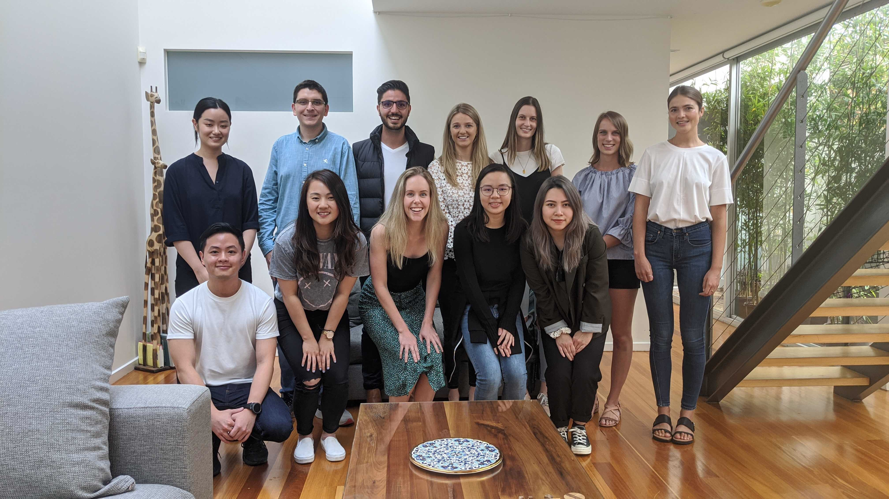

```{r load_packages, message=FALSE, warning=FALSE, include=FALSE} 

## load packages and setup
source("package_setup.R", echo=FALSE)

students <- read_excel(file.path(basedir, "WileyDossier/CV_Full.xlsx"),
                       sheet = "People")
students <- as.data.table(students)[Status == "Current" & Consent == 1][order(FamilyName)]

students[, PeopleSummary := sprintf(
  "### %s %s | %d - current | %s \n %s \n",
  GivenName, FamilyName, Started,
  Type, Bio)]


```



<br></br>

`r paste(students[, PeopleSummary], collapse = "\n\n -------------------- \n\n")`


### Group Photo - 2020




### Group Photo - 2019


